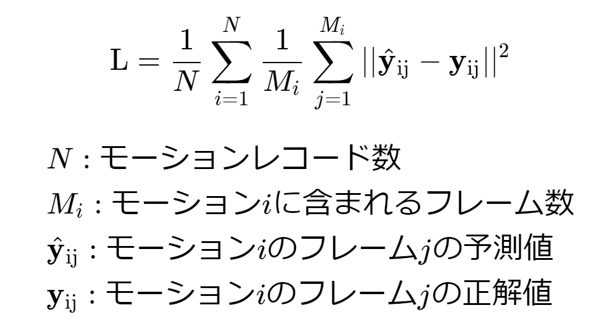

# モーションデータチャレンジ

## 概要
フレームが等間隔で失われたモーションデータファイルの復元の精度を競います。

## ファイルについて

- ダウンロードファイルにはzip圧縮されたcsvファイルが格納されています。

- ファイルはtrainとtestの2つのフォルダに分かれています。trainフォルダ内のtrain.csvは訓練用データです。testフォルダにフレームが落とされたデータが入っており、こちらの復元を行ってください。
  

- csvファイルの各要素の説明は以下の通りです。

    - 最初の行は各列の名称、続く行には1フレームごとの数値が格納されています。

    - フレームの数はモーションによって異なります。

	- データの1列目にはモーションのID（列名：motion）、2列目にはフレーム番号（列名:frame_id）が割り振られています。

    - 3列目以降の列は3列ごとに3次元の座標(xyz)を表しており、以下の21関節の情報が格納されています。
	    - 3-5列目 : 腰の関節
	    - 6-8列目 : 背骨の関節（腰の関節に接続しています）
	    - 9-11列目 : 胸の関節（背骨の関節に接続しています）
	    - 12-14列目 : 首の関節（胸の関節に接続しています）
	    - 15-17列目 : 頭の関節（首の関節に接続しています）
	    - 18-20列目 : 左肩の関節（胸の関節に接続しています）
	    - 21-23列目 : 左腕の付け根の関節（左肩の関節に接続しています）
	    - 24-26列目 : 左ひじの関節（左腕の関節に接続しています）
	    - 27-29列目 : 左手の関節（左ひじの関節に接続しています）
	    - 30-32列目 : 右肩の関節（胸の関節に接続しています）
	    - 33-35列目 : 右腕の付け根の関節（右肩の関節に接続しています）
	    - 36-38列目 : 右ひじの関節（右腕の関節に接続しています）
	    - 39-41列目 : 右手の関節（右ひじの関節に接続しています）
	    - 42-44列目 : 左脚の付け根の関節（腰の関節に接続しています）
	    - 45-47列目 : 左膝の関節（左脚の付け根の関節に接続しています）
	    - 48-50列目 : 左足のかかとの関節（左膝の関節に接続しています）
	    - 51-53列目 : 左足のつま先の関節（左足のかかとの関節に接続しています）
	    - 54-56列目 : 右脚の付け根の関節（腰の関節に接続しています）
	    - 57-59列目 : 右膝の関節（右脚の付け根の関節に接続しています）
	    - 60-62列目 : 右足のかかとの関節（右膝の関節に接続しています）
	    - 63-65列目 : 右足のつま先の関節（右足のかかとの関節に接続しています）
	    

	- testフォルダには test_easy.csv ・ test_normal.csv ・ test_hard.csv の3種類のcsvファイルがあり、それぞれのファイルはモーションごとに5フレーム・15フレーム・45フレームに1フレームのみ書き込まれた状態になっています。したがって、間の4フレーム・14フレーム・44フレーム分の数値を補間することで、データを完成させることができます。

	- csvファイルは[こちら](https://bnken-athletics.s3.ap-northeast-1.amazonaws.com/b6pt433iFh25/CSVViewer.html)を使用して可視化できます。結果の確認にご利用ください。

## 提出について
- testデータと同様のファイル名で、3個のモーションファイル（test_easy.csv・test_normal.csv・test_hard.csv）を入れたフォルダをzip圧縮して提出してください。

- csvファイルの形式については以下の点に注意してください。

	- ダウンロード用データは欠損しているフレームは空のデータとして保存されていますので、こちらの数値を埋めた状態と同様のモーション数、行数、列数で提出してください。

	- 補間対象外の参照フレームも計算対象に含まれますので、提出の際はご注意ください。

- 採点には全難易度のファイルに対する補間が必要です。一部のファイルのみでは採点されませんのでご注意ください。

- 右上の提出ボタンは最終提出用となっています。スコアの確認にはアップロードボタンをご利用ください。

## 採点について
- 提出されたデータはモーションごとにMSE（最小二乗誤差）をとり、それらの平均で評価されます。計算式は以下の通りです。

	

 - 上の計算式は逆数をとり、スケーリングを行って採点結果に表示されます。

- 提出されたデータは分割され、以下の2つのスコアで評価されます。
	
	- 暫定スコア（チャレンジ開催中の暫定的なスコア）
	  - 提出されたファイルの50％のデータから算出されます。
	  - リーダーボードの順位はこのスコアを元に計算されます
	  - 暫定スコアはボード上では有効数字2桁に丸められて表示されます。
	  - 暫定スコアの誤差を下げる目的のみを考慮してモデルを学習した場合、過学習になる恐れがありますのでご注意ください。

	  
	- 最終スコア（最終結果用のスコア）
		- 提出されたファイルのうち、暫定スコア用のデータではない50％のデータから算出されます。
		- 最終スコアでは数値は丸めずに評価されます。
		- スコアが同じ場合、最終提出時刻を比較してより早い人が、より上の順位となります。
		- 最終スコアにより、最終順位が確定し、入賞対象者が選ばれます。
